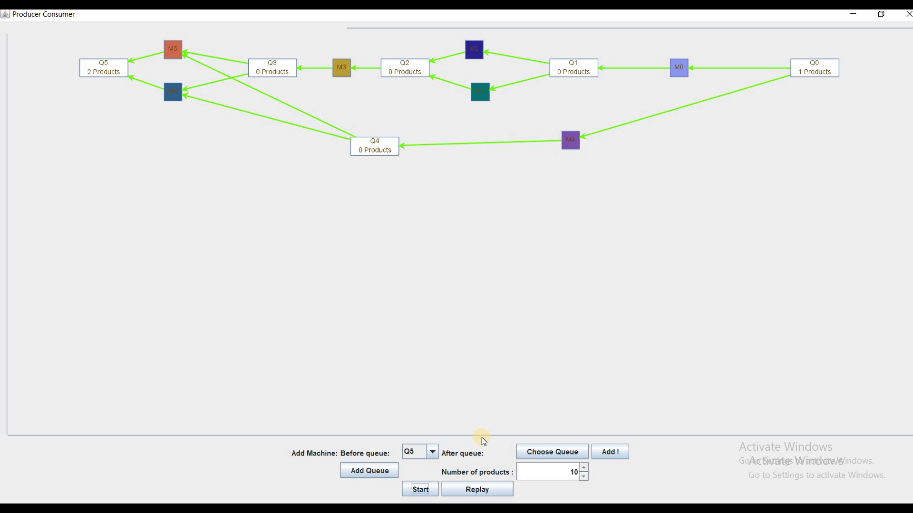

# Producer-Consumer-Simulation-App
Description:
An assembly line that produces different products consists of different processing machines Ms that are responsible for processing the product at different stages
and queue Qs to handle product movement between different processing stages (see figure below).
In this project we developed a simulation program to simulate this production line as a queueing network.

